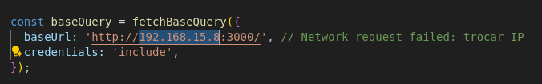

requirements:
have nodejs installed

create .env with the following secrets and fill with your own values:
REFRESH_TOKEN_SECRET="blablabla"
ACCESS_TOKEN_SECRET="blablablabla"

delete orders and users entries from db.json

start the project with:
npm install
npx tsc
npm start

adjust IP in frontend
src/services/api.service.ts:

